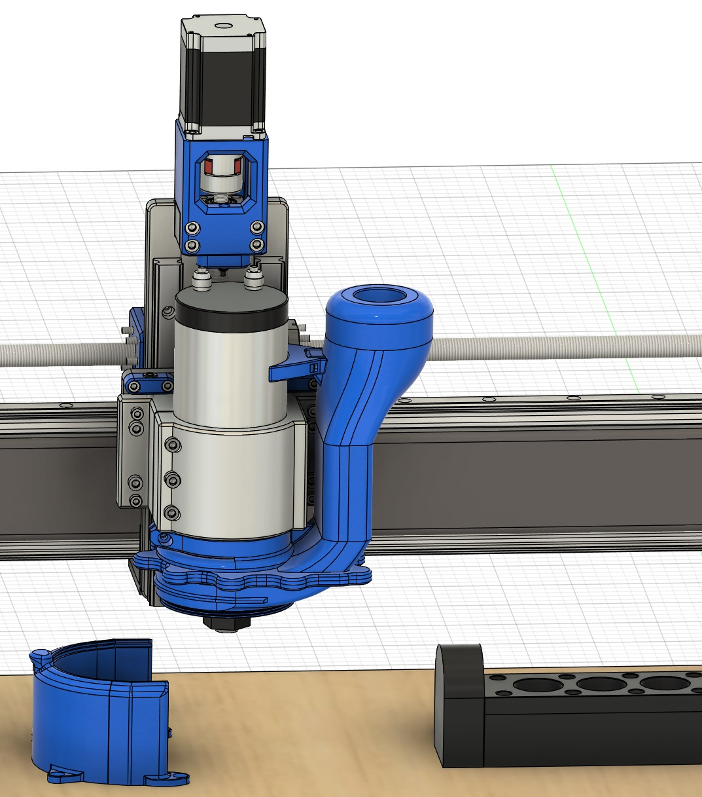
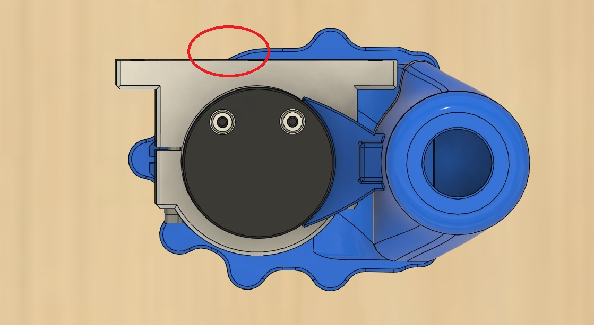

# Docking CNC dust shoe for 80mm diameter spindles. Designed for use with the RapidChange ATC tool changer.

### DESCRIPTION

This is a side-mount design intended to work with the typical style cast aluminium 80mm spindle clamp. Dust hose opening is set at 36mm - adjust in CAD if you require a different sized opening.

Clearance of the main body and the spindle clamp is tight, so you should defintely check the CAD in your setup to ensure the design will work - this is a large print.

There are Left mount and Right mount versions. There is also an alternative version of each with a Z cutout (one of the magnet tabs removed) on the side that faces the Z axis to avoid it contacting the Z ball screw. Check the design of your own machine to establish clearance. If clearance is no issue, it's obviously better to print the standard version of parts that uses all 20 magnets with no Z cutout.

The brush ring requires you to glue in some suitable dust shoe brush material. This threaded ring screws onto the dockable brush body.

Refer to the RapidChange ATC Discord for post-processing files that use this docking dust shoe as part of tool change routines.

### PRINTING

Best printed in ABS with 40% infill. Prints fine with 0.4 or 0.6 nozzle (0.6 recommended). 

Print parts in same orientation as provided STL files. When slicing the main body, dockable brush holder, and the dock, insert a pause/colour change after the last layer of the internal magnet pockets to allow you to add the magnets during print. 12mm magnets are inserted in the main body and dockable brush holder. A single 6mm magnet is inserted in the dock. Pay close attention to magnet orientation.

For the main dust shoe body, minimal supports are needed around the clamp area only. The rest of the main body prints without supports. The dockable brush holder will need to be printed with supports. No supports needed for the dock, brush ring or spindle brace. 

### BOM

```
20 x 12x2mm round N52 magnets (or 18 pieces if using the Z cutout version)
1 x 6x3mm round N52 magnet (for the dock)
M5 nut and bolt (for the clamp)
1 x large extra long zip tie (to secure spindle brace and main body to spindle) - or join multiple zip ties as required.
4 x wood screws (to secure dock to spoilboard)
```


### RIght-side version


### Overhead view (Z cutout version - shows removed magnet tab)



### THANKS

Thanks to Cheesy_popcorn on the RapidChange ATC Discord group for creating the original design from which this is derived.
